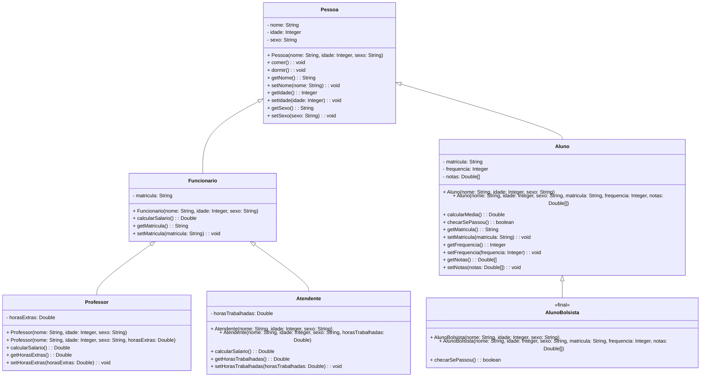

# Herança POO

```mermaid
classDiagram
  class Pessoa {
    - nome: String
    - idade: Integer
    - sexo: String
    + Pessoa(nome: String, idade: Integer, sexo: String)
    + comer(): void
    + dormir(): void
    + getNome(): String
    + setNome(nome: String): void
    + getIdade(): Integer
    + setIdade(idade: Integer): void
    + getSexo(): String
    + setSexo(sexo: String): void
  }

  class Funcionario {
    - matricula: String
    + Funcionario(nome: String, idade: Integer, sexo: String)
    + calcularSalario(): Double
    + getMatricula(): String
    + setMatricula(matricula: String): void
  }

  class Professor {
    - horasExtras: Double
    + Professor(nome: String, idade: Integer, sexo: String)
    + Professor(nome: String, idade: Integer, sexo: String, horasExtras: Double)
    + calcularSalario(): Double
    + getHorasExtras(): Double
    + setHorasExtras(horasExtras: Double): void
  }

  class Atendente {
    - horasTrabalhadas: Double
    + Atendente(nome: String, idade: Integer, sexo: String)
    + Atendente(nome: String, idade: Integer, sexo: String, horasTrabalhadas: Double)
    + calcularSalario(): Double
    + getHorasTrabalhadas(): Double
    + setHorasTrabalhadas(horasTrabalhadas: Double): void
  }

  class Aluno {
    - matricula: String
    - frequencia: Integer
    - notas: Double[]
    + Aluno(nome: String, idade: Integer, sexo: String)
    + Aluno(nome: String, idade: Integer, sexo: String, matricula: String, frequencia: Integer, notas: Double[])
    + calcularMedia(): Double
    + checarSePassou(): boolean
    + getMatricula(): String
    + setMatricula(matricula: String): void
    + getFrequencia(): Integer
    + setFrequencia(frequencia: Integer): void
    + getNotas(): Double[]
    + setNotas(notas: Double[]): void
  }

  class AlunoBolsista {
    <<final>>
    + AlunoBolsista(nome: String, idade: Integer, sexo: String)
    + AlunoBolsista(nome: String, idade: Integer, sexo: String, matricula: String, frequencia: Integer, notas: Double[])
    + checarSePassou(): boolean
  }

  Pessoa <|-- Funcionario
  Funcionario <|-- Professor
  Funcionario <|-- Atendente
  Pessoa <|-- Aluno
  Aluno <|-- AlunoBolsista
```
